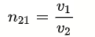
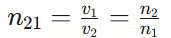
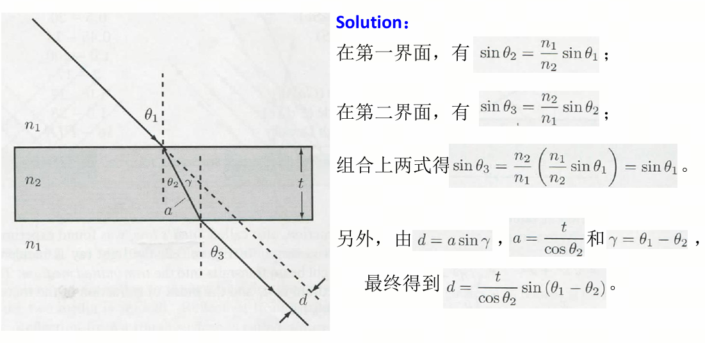

# 物镜的选择：从原理到应用

## 光波的本质——衍射
            点物（无限小）                 点物经物镜成像
            ─●─                          ╭─●─╮
              │  ← 实际光源                 │ 艾里斑
              ▼                            ╰───╯
                                   第一极小
              ↓                                ↓
   横向：r = 0.61λ/NA          轴向：Δz = 2λn/NA²
   （瑞利准则）                 （焦深 / 轴向分辨率）

## 折射率
* 定义：光学介质 2 相对于介质 1 的相对折射率由介质 1 中的光速与介质 2 中的光速之比给出  

* 绝对折射率：如果介质 1 是真空，那么此时介质 2 与介质 1 的相对折射率即绝对折射率。介质的绝对折射率的定义是真空中光速与介质中相速度之比     

## 相对折射率
* 介质 2 相对于介质 1：     
    
n₁、n₂ 分别是介质 1、2 的绝对折射率（相对真空）
n₂₁ = n₂/n₁：介质 2 的光比介质 1 的光慢多少倍

## 色散
在同一种介质中：
* 波长越短（频率越高）→ 折射率越大 → 速度越慢
* 紫色光比红色光在玻璃中跑得慢约 1%

        白色光
          │
          ▼
        ╱ ╲
       ╱   ╲  棱镜
      ╱     ╲
     ╱       ╲
    ╱_________╲
   ▼ ▼ ▼ ▼ ▼ ▼
   红 橙 黄 绿 蓝 紫
   
   紫光偏折最大，红光偏折最小

   

## 数字孔径NA
综合衡量物镜"收集光的能力"和"看细节的能力"。物镜收集的光线锥越宽（α越大），意味着它捕捉到了从物点发出的更多方向的波动信息。这些不同方向的光波在像平面干涉，才能重建出精细的结构。如果只能收集正前方很小的角度（θ很小），就像只用一根吸管看东西——视野极其模糊。      

NA=n⋅sinα
* n：物镜前透镜与样品之间介质的折射率
> 空气 n = 1.000    
> 水 n = 1.333  
> 香柏油 n = 1.515  
> 溴萘 n = 1.66 
* α：物镜能收集到的光锥的半张角（从样品焦点看物镜前透镜边缘的张角）

* NA 的本质 = 横向波矢分量的"收集能力"    
