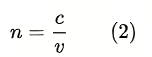
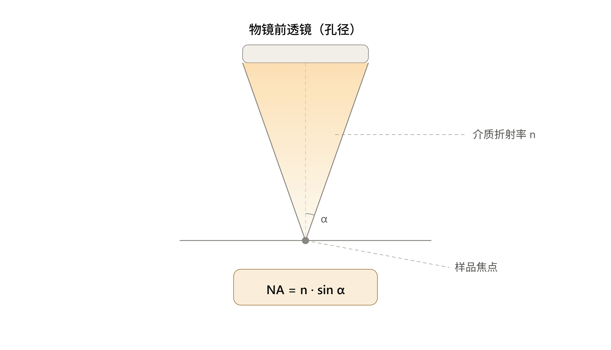
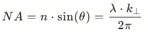
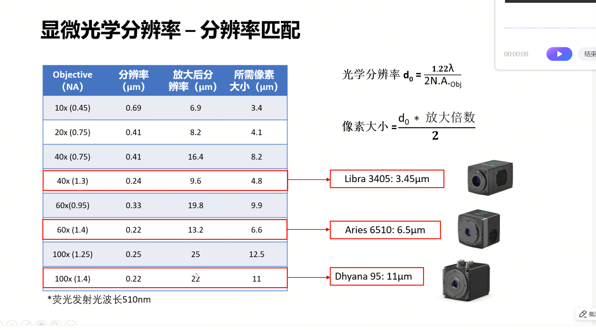
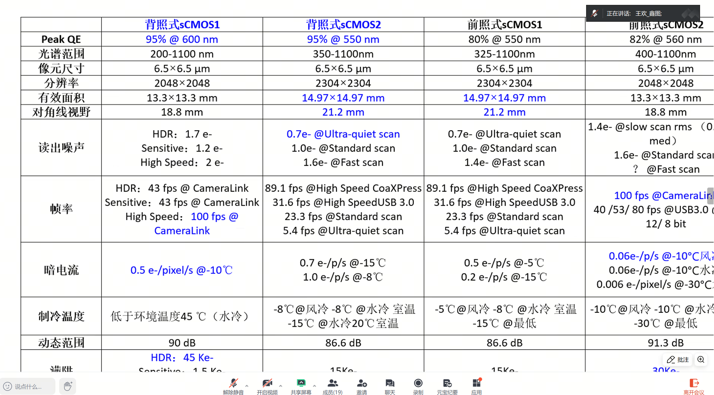
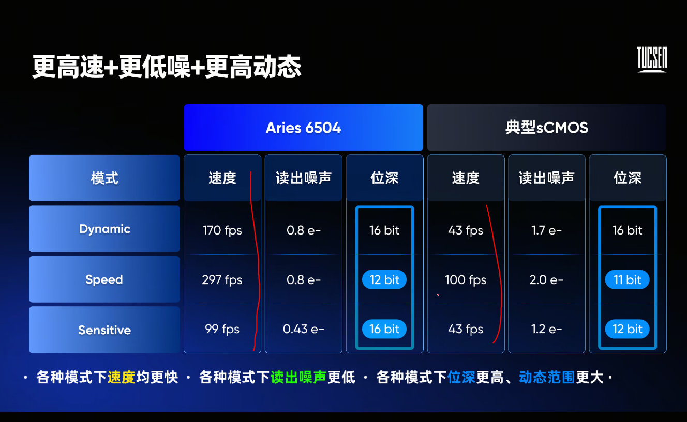
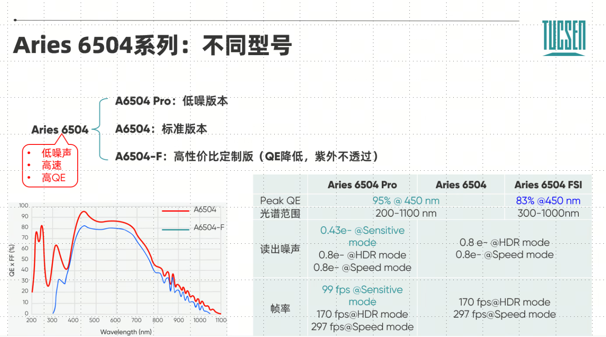

# 物镜的选择：从原理到应用

## 光波的本质——衍射
            点物（无限小）                 点物经物镜成像
            ─●─                          ╭─●─╮
              │  ← 实际光源                 │ 艾里斑
              ▼                            ╰───╯
                                   第一极小
              ↓                                ↓
   横向：r = 0.61λ/NA          轴向：Δz = 2λn/NA²
   （瑞利准则）                 （焦深 / 轴向分辨率）

## 折射率
* 定义：光学介质 2 相对于介质 1 的相对折射率由介质 1 中的光速与介质 2 中的光速之比给出  

* 绝对折射率：如果介质 1 是真空，那么此时介质 2 与介质 1 的相对折射率即绝对折射率。介质的绝对折射率的定义是真空中光速与介质中相速度之比     

## 相对折射率
* 介质 2 相对于介质 1：     
    
n₁、n₂ 分别是介质 1、2 的绝对折射率（相对真空）
n₂₁ = n₂/n₁：介质 2 的光比介质 1 的光慢多少倍

## 色散
在同一种介质中：
* 波长越短（频率越高）→ 折射率越大 → 速度越慢
* 紫色光比红色光在玻璃中跑得慢约 1%

        白色光
          │
          ▼
        ╱ ╲
       ╱   ╲  棱镜
      ╱     ╲
     ╱       ╲
    ╱_________╲
   ▼ ▼ ▼ ▼ ▼ ▼
   红 橙 黄 绿 蓝 紫
   
   紫光偏折最大，红光偏折最小

   

## 数字孔径NA
综合衡量物镜"收集光的能力"和"看细节的能力"。物镜收集的光线锥越宽（α越大），意味着它捕捉到了从物点发出的更多方向的波动信息。这些不同方向的光波在像平面干涉，才能重建出精细的结构。如果只能收集正前方很小的角度（θ很小），就像只用一根吸管看东西——视野极其模糊。      

NA=n⋅sinα
* n：物镜前透镜与样品之间介质的折射率
> 空气 n = 1.000    
> 水 n = 1.333  
> 香柏油 n = 1.515  
> 溴萘 n = 1.66 
* α：物镜能收集到的光锥的半张角（从样品焦点看物镜前透镜边缘的张角）

* NA 的本质 = 横向波矢分量的"收集能力"    

数字孔径和分辨率公式是显微成像里最容易"记住结论、忘了道理"的一块内容。我按物理意义→横向分辨率推导→轴向分辨率推导的顺序讲，尽量把每一步"为什么"讲清楚。

## 一、数字孔径 NA 的物理意义

先看定义：

$$NA = n \cdot \sin\alpha$$

- $\alpha$：物镜能收集到的光锥的半张角（从样品焦点看物镜前透镜边缘的张角）
- $n$：物镜前透镜与样品之间介质的折射率（空气 1.0，水 1.33，甘油约 1.45，油 1.515）**为什么是 $n\sin\alpha$，而不是单纯的 $\sin\alpha$？**

关键在于：决定分辨率的不是"角度"本身，而是物镜能收集到的**横向波矢分量** $k_t = \dfrac{2\pi}{\lambda_0}\,n\sin\alpha$。

样品里越精细的结构，衍射光散得越开（衍射角越大）；物镜只能收集张角在 $\pm\alpha$ 以内的衍射光。把物镜浸入折射率 $n$ 更大的介质（水、油），相当于把介质中的波长压缩为 $\lambda_0/n$——同样的物理精细结构，衍射光在高折射率介质里张开的角度会变小，于是更多"携带精细结构信息"的衍射级次能落入同一个物理收集角 $\alpha$ 内。这就是油镜（NA 可达 1.4~1.49）分辨率远高于同倍率干镜（NA 上限约 0.95）的根本原因。

NA 还决定了两件事，后面推导会反复用到：
- **光收集效率** $\propto NA^2$（近似正比于收集立体角），这也是荧光信噪比与曝光时间的关键参数
- **景深/轴向范围**：NA 越大，聚焦范围越窄——这正是第三部分要推导的内容

## 二、瑞利判据：横向分辨率公式怎么来的

### 第一步：为什么一个点会被"抹"成一个斑

即使物镜完美无像差，光的**波动性**也会让一个理想点光源成像后不是一个点，而是一个有中心亮斑和同心环的衍射图案——**艾里斑（Airy pattern）**。这是光通过圆形孔径（物镜的有效孔径）发生**夫琅禾费衍射**的结果。

对直径 $D$ 的圆孔，衍射光强分布为：

$$I(\theta) \propto \left[\frac{2J_1(x)}{x}\right]^2, \quad x = \frac{\pi D}{\lambda}\sin\theta$$

其中 $J_1$ 是一阶贝塞尔函数。$J_1(x)/x$ 的第一个零点在 $x = 3.8317$（这是贝塞尔函数的数学性质，不是拟合出来的），代入解出第一暗环对应的角度：

$$\sin\theta_1 = \frac{3.8317\,\lambda}{\pi D} \approx \frac{1.22\,\lambda}{D}$$

### 第二步：把"孔径衍射角"换算成"物镜聚焦光斑半径"推导思路是这样的：一个数值孔径为 NA 的物镜，其实就是把"孔径衍射"问题反过来看——不是平面波穿过孔径向远处发散，而是会聚波从孔径会聚到焦点。利用像方孔径半径 $a$、像方焦距 $f'$ 与半张角的关系（阿贝正弦条件 $a = f'\sin\alpha'$，这个关系对校正良好的高 NA 物镜同样精确成立），把上面的角度公式换算成焦平面上的**物理距离**：

$$r = f'\sin\theta_1 \approx f' \cdot \frac{1.22\lambda}{D} = \frac{a}{\sin\alpha'} \cdot \frac{1.22\lambda}{2a} = \frac{0.61\lambda}{\sin\alpha'}$$

再把 $\sin\alpha'$ 换成一般化的数值孔径（含介质折射率 $n$），就得到艾里斑半径公式：

$$r_{Airy} = \frac{0.61\,\lambda}{NA}$$

### 第三步：瑞利判据——"刚好能分辨"是什么状态

瑞利提出的判据很直观：**当一个艾里斑的中心峰恰好落在另一个艾里斑的第一暗环上时，两点"刚好可分辨"**——此时合成强度曲线中心会出现一个约 26% 的凹陷（如上图黑色实线），比这更近，凹陷消失，两点就糊成一团了。

因为暗环半径正是 $r_{Airy}$，所以最小可分辨距离——**瑞利判据横向分辨率公式**——就是：

$$\boxed{d_{lateral} = 0.61\,\frac{\lambda}{NA}}$$

（有些教材写成 $1.22\lambda/(2NA)$，是同一个数，只是没化简。）

## 三、轴向分辨率（Z轴）公式怎么推出来

横向分辨率讨论的是"垂直于光轴平面内"的衍射极限；轴向分辨率讨论的是"沿光轴方向能分辨多薄一层"，物理机制不是衍射孔径，而是**离焦引起的光程差**。推导逻辑完全不同，也更直观：### 推导过程

以理想焦点 $F$ 为球心，边缘光线（半张角 $\alpha$）上的点 $A$ 到 $F$ 的距离记为参考球面半径 $R$。现在把观察点从 $F$ 沿光轴挪到离焦点 $P$（偏移量 $\Delta z$），算一算边缘光线到 $P$ 的路径 $AP$ 和到 $F$ 的路径 $AF=R$ 差了多少：

用勾股定理展开（$\Delta z \ll R$ 时用二项展开取一阶项）：

$$AP - AF \approx \Delta z\,(1-\cos\alpha)$$

这一步的物理含义很直白：**轴上的中心光线（$\alpha=0$）走到 P 和走到 F 的路程差正好就是 $\Delta z$；边缘光线因为是斜着入射的，路程差要打一个 $(1-\cos\alpha)$ 的折扣**——这正是图中虚线（到P）和实线（到F）长度差的来源。

再套用经典的**瑞利 1/4 波长判据**（离焦造成的波前误差达到 $\lambda/4$ 时，成像质量刚好降到不可接受的临界点，这与光学中定义"衍射极限焦深"用的是同一个判据）：

$$\Delta z\,(1-\cos\alpha) = \frac{\lambda_0}{4n}$$

（这里用介质中的波长 $\lambda_0/n$，因为光程差是在介质里累积的）

用小角度近似 $1-\cos\alpha \approx \dfrac{\alpha^2}{2}$，并代入 $\sin\alpha \approx \alpha = NA/n$：

$$1-\cos\alpha \approx \frac{1}{2}\left(\frac{NA}{n}\right)^2$$

代回上式，解出 $\Delta z$（这是"单侧"离焦量），两侧对称加起来就是总的轴向分辨范围：

$$\boxed{\Delta z_{axial} = \frac{n\,\lambda}{NA^2}}$$

（不同文献对"分辨率"的定义方式不完全一致——有的用半宽、有的用全宽、有的直接对三维 PSF 做数值积分取 FWHM——数字系数会在 1~2 之间浮动，但 $n\lambda/NA^2$ 这个**函数形式**是所有版本共同的核心。）

## 四、为什么 Z 轴分辨率总是比 XY 差一大截

把两个公式并排看，差别一目了然：

$$d_{lateral} = 0.61\,\frac{\lambda}{NA} \qquad\qquad \Delta z_{axial} = n\,\frac{\lambda}{NA^2}$$

- **横向分辨率对 NA 是一次方关系**——因为它来自孔径衍射的一阶效应（波矢的横向分量直接正比于 $\sin\alpha$）
- **轴向分辨率对 NA 是二次方关系（还带一个 $n$）**——因为它来自离焦光程差里的 $(1-\cos\alpha)\approx \alpha^2/2$，这是个二阶效应

这意味着提高 NA 对轴向分辨率的收益是"平方级"的，但也导致了一个不对称的结果：同一个 NA=0.9 的物镜，理论上 XY 方向能分到约 0.61×0.5/0.9≈0.34 μm，Z 方向却要 1×0.5/0.9²≈0.62 μm——**Z 方向天生比 XY 方向粗糙近一倍**。这也是为什么高内涵成像里，做 3D 类器官/组织切片的 Z-stack 时，共聚焦、双光子、结构光照明这些"专门优化轴向分辨率"的技术会比单纯堆 NA 更划算。

如果你想接着看这两个公式在选物镜时具体怎么用（比如给定样品最小结构尺寸，反推该配多大 NA），我可以结合前面聊过的类器官/细胞核识别场景具体算一遍。

