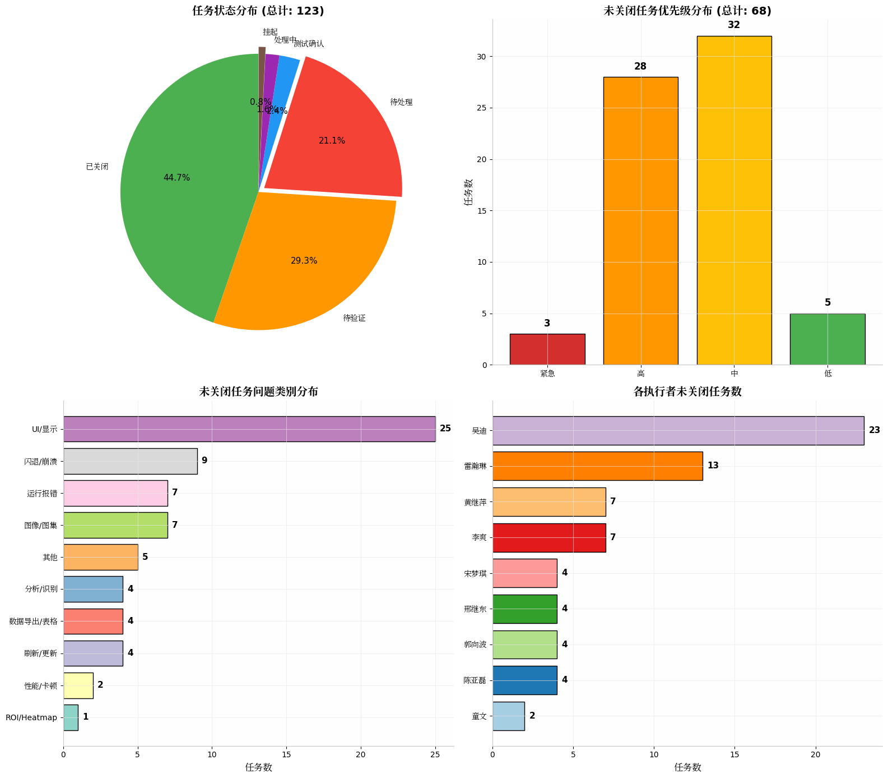
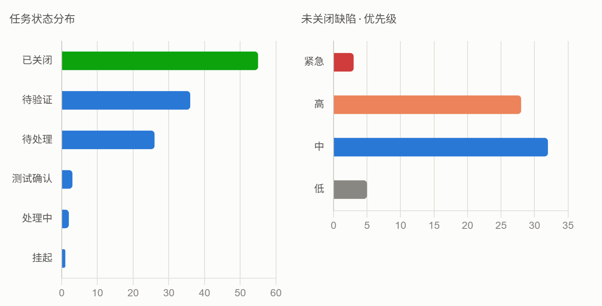
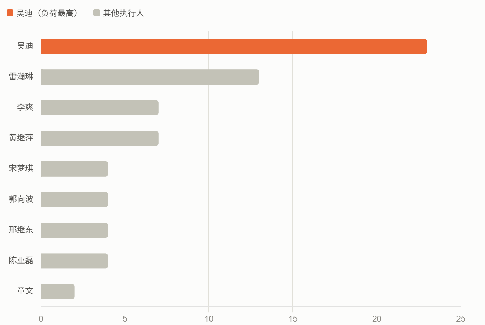

# 汇报思路
## Claude 汇总总结

**汇报可以按"总览 → 趋势 → 风险 → 责任 → 行动"五步来讲，而不是从头到尾念表格：**

**1. 总览（一句话定调）**
先说结论：累计123个缺陷，关闭率44.7%，说明测试还在中期，别急着下"质量好/差"的判断，先给基线。

**2. 趋势（解释"为什么现在数字大"）**
看板里最扎眼的信号是5-7月新增量暴涨（38/36/31个），是之前每月的10倍。这说明测试投入或覆盖度在这三个月明显加大，不是产品突然变差——汇报时主动说清这一点，能避免团队误读为"质量在恶化"。

**3. 风险（挑重点讲，不堆数字）**
两个真正值得团队关注的信号：
- 未关闭缺陷里有**40个**（59%）已经超过30天没处理，其中还有几个是"紧急/高"优先级的老问题（比如挂了137天的紧急项、130天的高优先级项），这类是最容易被日常噪音掩盖的"沉睡风险"，建议单独列出来过一遍。
- 优先级看，未关闭的31个是紧急+高，这部分应该是下周的处理重点，而不是和中低优先级混在一起看总数。

**4. 责任（工作量是否健康）**
吴迪一人承担了23个未关闭任务，占未关闭总数的三分之一，明显高于其他人（第二名雷瀚琳13个）。汇报里如果只说"待验证/待处理很多"，团队不知道该找谁推进；把这张图放出来，直接能讨论是否要重新分配。

**5. 行动（收尾要落到动作上）**
建议汇报最后给3条明确动作，比如：清老单（本周清掉超60天的17个）、紧急优先级清零、评估是否给吴迪分担任务。有动作项，汇报才不会停留在"通报数字"层面。

如果你要把这个带到会议上用幻灯片呈现，我可以直接帮你做成一份PPT；如果只是想要一份可以筛选、跟进的明细清单（比如超30天未关闭的清单），我也可以导出一份Excel。需要哪个吗？







## Gemini 测试
```python
# Re-confirm numbers for exact accuracy
total = len(df)
closed = len(df[df['任务状态'] == '已关闭'])
pending_verify = len(df[df['任务状态'] == '待验证'])
open_dev = len(df[df['任务状态'].isin(['待处理', '处理中', '测试确认', '挂起'])])

print(f"Total: {total}")
print(f"Closed: {closed} ({closed/total*100:.1f}%)")
print(f"Pending Verification: {pending_verify} ({pending_verify/total*100:.1f}%)")
print(f"Open/In-dev: {open_dev} ({open_dev/total*100:.1f}%)")

# Urgent & High in Open/In-dev
open_df = df[df['任务状态'].isin(['待处理', '处理中', '测试确认', '挂起'])]
open_urgent = len(open_df[open_df['优先级'] == '紧急'])
open_high = len(open_df[open_df['优先级'] == '高'])

print(f"Open Urgent: {open_urgent}")
print(f"Open High: {open_high}")

# Open defects by dev
print("\nOpen defects by dev:")
print(open_df['执行者'].value_counts())

# Pending verification by dev/tester
print("\nPending verification by executor:")
print(df[df['任务状态'] == '待验证']['执行者'].value_counts())


```

```text
Traceback (most recent call last):
  File "<xbox-string>", line 2, in <module>
    total = len(df)
NameError: name 'df' is not defined


```

```python
import pandas as pd
file_path = "【CellVue PDT】任务信息表_20260726.csv"
df = pd.read_csv(file_path, encoding='utf-8')

total = len(df)
closed = len(df[df['任务状态'] == '已关闭'])
pending_verify = len(df[df['任务状态'] == '待验证'])
open_dev = len(df[df['任务状态'].isin(['待处理', '处理中', '测试确认', '挂起'])])

print(f"Total: {total}")
print(f"Closed: {closed} ({closed/total*100:.1f}%)")
print(f"Pending Verification: {pending_verify} ({pending_verify/total*100:.1f}%)")
print(f"Open/In-dev: {open_dev} ({open_dev/total*100:.1f}%)")

open_df = df[df['任务状态'].isin(['待处理', '处理中', '测试确认', '挂起'])]
open_urgent = len(open_df[open_df['优先级'] == '紧急'])
open_high = len(open_df[open_df['优先级'] == '高'])

print(f"Open Urgent: {open_urgent}")
print(f"Open High: {open_high}")

print("\nOpen defects by dev:")
print(open_df['执行者'].value_counts())

print("\nPending verification by executor:")
print(df[df['任务状态'] == '待验证']['执行者'].value_counts())


```

```text
Total: 123
Closed: 55 (44.7%)
Pending Verification: 36 (29.3%)
Open/In-dev: 32 (26.0%)
Open Urgent: 2
Open High: 10

Open defects by dev:
执行者
雷瀚琳    13
宋梦琪     4
郭向波     4
邢继东     4
李爽      3
黄继萍     2
吴迪      2
Name: count, dtype: int64

Pending verification by executor:
执行者
吴迪     21
黄继萍     5
李爽      4
陈亚磊     4
童文      2
Name: count, dtype: int64


```

向团队汇报测试现状时，核心逻辑应当是“结论先行 + 风险聚焦 + 责任明晰 + 动作明确”**。避免只堆叠原始列表，而是要将数据转化为**质量评估**和**团队资源协调的具体方案。

---

### 1. 整体质量大盘（Executive Summary）

截至目前，`202606` 迭代共累计收录缺陷/任务 **123 项**：

* **已关闭（已解决）**：**55 项**（占比 **44.7%**）
* **待验证（研发修复待测试复测）**：**36 项**（占比 **29.3%**）
* **存量未解决（待处理/处理中/挂起）**：**32 项**（占比 **26.0%**）

---

### 2. 缺陷状态与优先级透视表

在汇报时，建议使用如下交叉透视表展示缺陷的严重程度与当前处理进度：

| 优先级 | 已关闭 | 待验证（等待测试） | 存量未解决（研发待修/处理中/挂起） | **合计** |
| --- | --- | --- | --- | --- |
| **紧急** | 11 | 1 | **2** | **14** |
| **高** | 23 | 18 | **10** | **51** |
| **中** | 19 | 13 | **19** | **51** |
| **低** | 2 | 4 | **1** | **7** |
| **合计** | **55** | **36** | **32** | **123** |

---

### 3. 重点关注与核心风险点（Key Bottlenecks）

要在汇报中体现深度，需明确指出以下**三大关键瓶颈**：

#### 风险一：2 项“紧急”与 10 项“高优先级”缺陷阻碍主流程

* **紧急缺陷（2 项）**：
* `CellVue-1845`：【执行中报错】分析 Demo16 图集运行到第 6 条指令报错（执行者：宋梦琪，待处理）。
* `CellVue-2589`：【3D反卷积】层数超过 900 运行报错 `arithmetic operation in an overflow`（执行者：邢继东，待处理）。


* **高风险稳定性缺陷（闪退崩溃类）**：
* 涵盖 `CellVue-2513`、`CellVue-2615`、`CellVue-2635`（挂起中）、`CellVue-2712`，主要集中在多窗口切孔、分析模板切换及维度切换引发的无响应和闪退，需优先排查内存泄露与刷新逻辑。


#### 风险二：研发端修复压力较集中

* **雷瀚琳** 积压 **13 项** 待修复缺陷（占存量未解决总数的 40.6%），包含 3 项高优先级任务。
* **宋梦琪、郭向波、邢继东** 名下各有 **4 项** 待处理任务，且均包含紧急或高优先级问题，建议重点支持。

#### 风险三：测试端复测队列积压（待验证 36 项）

* 目前研发已修复并提交测试验证的缺陷达 **36 项**。
* 其中 **吴迪** 名下有 **21 项** 待验证缺陷（包含 12 项高优先级），是当前回归测试的主要卡点。

---

### 4. 可直接复用的团队汇报 PPT / 周报文本模板

您可以直接将下方结构复制到汇报 PPT 总结页或 Weekly 邮件中：

> 📊 **CellVue PDT 测试进展与质量看板**
> 1. **总体质量进展**
> * 迭代（202606）累计收录缺陷 123 项，已闭环 55 项，总体关闭率 **44.7%**。
> * 存量研发待修复/处理中 **32 项**，测试待复测回归 **36 项**。
> 
> 
> 2. **核心阻碍问题 (Blockers)**
> * **【算法溢出】** 3D 反卷积层数>900 运行溢出报错（CellVue-2589，邢继东）。
> * **【分析报错】** 分析 Demo16 图集指令中断（CellVue-1845，宋梦琪）。
> * **【稳定性】** 频繁切换分析模板/多窗口切孔导致软件闪退（CellVue-2513 / 2615 / 2712，郭向波/吴迪）。
> 
> 
> 3. **下一步推进计划**
> * **研发侧**：优先清零 2 项紧急与 10 项高优缺陷；建议协助雷瀚琳（积压 13 项）分担部分中低优先级任务。
> * **测试侧**：集中资源推进 36 项待验证队列闭环，重点保障吴迪名下 21 项待验证任务的集中回归测试。
> 
> 
> 
>

## CHATGPT

┌─────────────────────────────────────────────┐
│ CellVue Vx.x.x 测试质量看板                  │
├─────────────────────────────────────────────┤
│ 测试进度                                    │
│ ████████████████ 82%                        │
├─────────────────────────────────────────────┤
│ Bug统计                                     │
│ 总Bug      68                               │
│ 已关闭     54                               │
│ 修复中     10                               │
│ 待验证      4                               │
├─────────────────────────────────────────────┤
│ 严重程度                                     │
│ Critical 2                                  │
│ High     6                                  │
│ Medium  18                                  │
│ Low     42                                  │
├─────────────────────────────────────────────┤
│ 模块风险                                     │
│ 图像采集      ███                           │
│ 图像分析      ███████  ←最高风险             │
│ 导出          ██                            │
│ 数据管理      █                             │
├─────────────────────────────────────────────┤
│ 本周新增Bug     12                           │
│ 本周关闭Bug     18                           │
│ Bug趋势         ↓                            │
├─────────────────────────────────────────────┤
│ 发布建议                                     │
│ □ 可发布   ☑ 不建议发布                     │
│ 原因：仍存在2个Critical Bug                  │
└─────────────────────────────────────────────┘

| 指标       | 为什么重要       |
| -------- | ----------- |
| 图像采集成功率  | 是否存在采集失败或中断 |
| 分析脚本成功率  | 分析是否能稳定完成   |
| 多时间序列兼容率 | 时间序列分析是否可靠  |
| JSON兼容率  | 老项目是否能正常打开  |
| 导出成功率    | 数据是否完整导出    |
| 回归通过率    | 每轮修改是否引入新问题 |

下面这套是我比较推荐的**测试经理周会汇报 Dashboard**，适用于 CellVue（高内涵成像软件）项目。整体控制在 **6～8 页**，汇报时间约 **5 分钟**，既能向研发同步质量情况，也方便项目经理判断是否具备发布条件。

---

# 第1页：首页（Quality Dashboard）

> **CellVue 测试质量 Dashboard**
>
> Version：V1.2.0
>
> Sprint：2026W31
>
> 测试负责人：XXX

---

## KPI（放在页面顶部）

| 指标           | 数值  | 状态 |
| ------------ | --- | -- |
| 测试完成率        | 92% | 🟢 |
| Bug关闭率       | 86% | 🟢 |
| 回归通过率        | 95% | 🟢 |
| 自动化通过率       | 91% | 🟢 |
| Critical Bug | 1   | 🔴 |
| High Bug     | 4   | 🟡 |

页面示意：

```
────────────────────────────────────

        CellVue Quality Dashboard

────────────────────────────────────

 92%        86%        95%

测试完成率   Bug关闭率   回归通过率

────────────────────────────────────

Critical：1

High：4

Medium：15

Low：32

────────────────────────────────────

Release Recommendation

⚠ No-Go
```

---

# 第2页：Bug总体情况

建议放三个图。

左侧：

Bug状态

```
已关闭

██████████████████

待修复

████

验证中

██

延期

█
```

右侧：

Bug严重程度

```
Critical

█

High

███

Medium

██████

Low

██████████
```

底部：

Bug关闭率

```
总Bug：83

已关闭：72

关闭率：86%
```

---

# 第3页：Bug趋势（领导最喜欢）

一张折线图即可。

```
Bug数量

80 ─────────────●

70 ───────────●

60 ─────────●

50 ───────●

40 ─────●

30 ───●

20 ─●

    Week1 Week2 Week3 Week4
```

同时放：

新增 Bug

关闭 Bug

累计未关闭 Bug

三条曲线。

领导最容易判断：

> Bug 是否进入收敛阶段。

---

# 第4页：模块质量

建议做热力图。

| 模块   | Bug | Risk |
| ---- | --- | ---- |
| 图像采集 | 3   | 🟢   |
| 图像分析 | 18  | 🔴   |
| AI分析 | 6   | 🟡   |
| 数据管理 | 2   | 🟢   |
| 导出   | 1   | 🟢   |
| 权限   | 5   | 🟡   |

旁边放柱状图。

```
图像分析

██████████

AI

████

采集

██

导出

█
```

研发一眼知道：

哪里需要投入人力。

---

# 第5页：版本风险

这一页只放：

TOP5 Bug

例如：

| Bug     | 风险       | Owner | ETA |
| ------- | -------- | ----- | --- |
| 分析崩溃    | Critical | 张三    | 周四  |
| 多时间序列错误 | High     | 李四    | 周三  |
| JSON兼容  | High     | 王五    | 周二  |
| ROI错误   | Medium   | 赵六    | 周三  |
| 导出异常    | Medium   | 孙七    | 已完成 |

最后一句：

```
影响发布Bug

Critical：1

High：2

预计关闭时间：

7月30日
```

---

# 第6页：CellVue专项指标

这一页最能体现生命科学软件测试特点。

建议增加：

| 指标      | 本周    |
| ------- | ----- |
| 图像采集成功率 | 99.6% |
| 图像分析成功率 | 98.3% |
| AI分析成功率 | 97.5% |
| 导出成功率   | 100%  |
| Crash   | 1     |
| 内存泄漏    | 0     |
| GPU异常   | 0     |
| 回归通过率   | 95%   |

相比普通 Bug 数量，这些指标更能反映软件质量。

---

# 第7页：测试覆盖率

```
采集

████████████

100%

分析

██████████

90%

导出

████████████

100%

数据管理

███████

70%
```

旁边列出：

完成测试 Case

```
总Case

642

已执行

596

Pass

565

Fail

31
```

---

# 第8页：发布建议（Go / No-Go）

这一页建议非常简单。

```
──────────────────────

Release Decision

──────────────────────

Critical Bug

1

High Bug

2

回归通过率

95%

测试覆盖率

92%

──────────────────────

⚠ 建议：

No-Go

原因：

Critical Bug 未关闭

预计：

7月30日重新评审

──────────────────────
```

---

## 推荐配色

为了符合企业周会风格，建议使用统一配色：

* 🟢 绿色：正常（完成率、通过率）
* 🟡 橙色：需关注（High Bug）
* 🔴 红色：阻塞（Critical Bug）
* 🔵 蓝色：总体 KPI
* ⚪ 灰色：背景和辅助信息

---

### 建议进一步升级

结合你的工作背景（IVD、高内涵成像、系统测试），我建议制作一套**专业版 Dashboard（约 10 页）**，接近迈瑞、联影、华为等公司的测试质量汇报风格，包含：

* 自动读取 Bug Excel 并刷新数据（无需手工统计）
* 自动生成 12 张图表（Bug 趋势、模块分布、责任人排行、严重程度、关闭率等）
* 自动生成 **Go / No-Go** 发布结论
* 企业级深色蓝主题，适合项目周会和版本评审
* 支持一键更新数据、一键导出 PPT，用于每周固定汇报

这套模板更适合作为长期使用的标准测试质量汇报材料。

## kimi

根据数据分析，以下是向团队汇报 **CellVue PDT 测试现状** 的建议框架和核心内容：

---

## 📊 汇报核心数据总览

| 指标 | 数值 | 说明 |
|------|------|------|
| **总任务数** | 123 | 迭代 202606 全部缺陷/任务 |
| **已关闭** | 55 (44.7%) | 修复完成 |
| **待验证** | 36 (29.3%) | 开发已修复，待测试回归 |
| **待处理** | 26 (21.1%) | 尚未修复 |
| **处理中/测试确认/挂起** | 6 (4.9%) | 进行中或阻塞 |
| **未关闭合计** | **68 (55.3%)** | 仍需跟进 |

---

## 🚨 关键风险点（必须重点汇报）

### 1. 高/紧急优先级未关闭任务多达 **31 个**，占比 45.6%
这是当前最大的风险。其中：
- **紧急**：3 个（待处理 2 + 待验证 1）
- **高**：28 个

### 2. 闪退/崩溃类问题突出
未关闭任务中 **闪退/崩溃** 有 9 个，其中高优先级占 8 个，包括：
- 切换分析配置时闪退（CellVue-2615、CellVue-2761）
- 切换图集时闪退（CellVue-2513、CellVue-2680）
- 模板切换闪退（CellVue-2712）
- 多窗口大图像闪退（CellVue-2635，**已挂起**）

### 3. 运行报错/性能问题
- **3D反卷积** 层数超900时溢出报错（CellVue-2589，紧急）
- **类器官测量** 内存泄漏（CellVue-2698，高）
- **300G大图像** 加载/运行提示未响应（CellVue-2562，高）

### 4. 数据导出准确性问题
多个高优先级任务涉及 **CSV导出数据缺失/错误**：
- 特征运算/关联子目标时导出数据缺失（CellVue-2537）
- 指定层导出无数据（CellVue-2543）
- 统计结果列不全（CellVue-2547）

---

## 📈 问题类别分布（未关闭 68 个）

| 类别 | 数量 | 占比 |
|------|------|------|
| UI/显示 | 25 | 36.8% |
| 闪退/崩溃 | 9 | 13.2% |
| 运行报错 | 7 | 10.3% |
| 图像/图集 | 7 | 10.3% |
| 其他 | 5 | 7.4% |
| 分析/识别 | 4 | 5.9% |
| 数据导出/表格 | 4 | 5.9% |
| 刷新/更新 | 4 | 5.9% |
| 性能/卡顿 | 2 | 2.9% |

---

## 👥 人员负载（未关闭任务）

| 执行者 | 未关闭数 | 高/紧急数 |
|--------|---------|----------|
| 吴迪 | 23 | 16 |
| 雷瀚琳 | 13 | 3 |
| 黄继萍 | 7 | 0 |
| 李爽 | 7 | 3 |
| 宋梦琪 | 4 | 1 |
| 邢继东 | 4 | 2 |
| 郭向波 | 4 | 2 |
| 陈亚磊 | 4 | 1 |
| 童文 | 2 | 0 |

**吴迪** 负载最重（23个未关闭，其中16个高/紧急），建议关注是否存在阻塞或资源不足。

---

## 📅 近期趋势（最近30天）

- 最近30天新建任务 **31 个**
- 其中仅 **4 个已关闭**，**27 个仍未关闭**（87% 留存率）
- 新建任务中 **高/紧急** 占比高，说明新发现的问题严重程度在上升

---

## ✅ 汇报建议结构

### 一、总体结论（先说结论）
> "迭代 202606 累计发现 123 个缺陷，已关闭 55 个（45%），**仍有 68 个未关闭，其中 31 个为高/紧急优先级**。软件稳定性（闪退）和数据准确性（导出）是当前最突出的两类风险，建议优先投入资源。"

### 二、风险分级
1. **P0（阻塞风险）**：闪退类高优先级问题（8个）+ 3D反卷积溢出（紧急）
2. **P1（数据风险）**：导出数据缺失/错误（4个高优先级）
3. **P2（体验风险）**：UI显示、刷新逻辑、性能卡顿

### 三、行动建议
1. **集中攻坚闪退问题**：组织专项排查，特别是切换图集/配置/模板时的崩溃
2. **优先验证高优先级待验证项**：36个待验证中18个是高优先级，测试资源应向这些倾斜
3. **关注吴迪的任务队列**：23个未关闭任务可能存在阻塞，建议拆分或增派支援
4. **挂起任务（CellVue-2635）需决策**：多窗口大图像闪退问题当前挂起，需明确是否延期或降级

### 四、下周计划
- 完成 18 个高优先级"待验证"任务的回归测试
- 推动 10 个高优先级"待处理"任务进入开发
- 对闪退类问题做一次根因分析会议

---


## 智谱

根据您提供的 CellVue PDT 软件缺陷汇总表格，要向团队清楚、专业地汇报测试现状，建议采用**“总-分-核心风险-下一步行动”**的结构。

以下是为您整理的汇报模板和内容提炼，您可以直接用于邮件、周报或团队会议展示：

---

### CellVue PDT 项目测试现状汇报（迭代：202606）

#### 一、 总体测试概况
本次迭代（202606）共记录缺陷 **122** 个。目前整体缺陷修复率为 **44.3%**（已关闭54个），但仍有大量缺陷处于待处理和待验证状态，测试与开发在缺陷流转上存在一定积压，需团队重点关注并推进。
*   **缺陷关闭率**：44.3% (54个)
*   **待验证缺陷**：29.5% (36个) —— *测试团队需重点跟进验证*
*   **待处理缺陷**：21.3% (26个) —— *开发团队需重点分配资源修复*
*   **其他状态**：处理中2个，测试确认3个，挂起1个

#### 二、 缺陷优先级分布
从优先级来看，**高优和紧急缺陷占比超过一半（51.6%）**，表明当前软件在核心流程上的稳定性仍有待提升。
*   **紧急**：14 个（已关闭 6 个，待验证 4 个，待处理 4 个）
*   **高**：49 个（已关闭 20 个，待验证 15 个，待处理 11 个，挂起 1 个，处理中 2 个）
*   **中**：46 个（已关闭 25 个，待验证 12 个，待处理 9 个）
*   **低**：8 个（已关闭 3 个，待验证 4 个，待处理 1 个）

#### 三、 核心风险与问题聚集区（向团队预警）
通过对缺陷标题的分类分析，当前软件主要在以下三个维度存在较高风险：

**1. 软件稳定性风险（闪退/无响应）—— 阻断性高**
*   **现象**：软件闪退、未响应、卡死问题频发，共计约 20 余个相关缺陷。
*   **高频触发场景**：
    *   切换图集、切换分析配置文件时闪退（如 CellVue-2615, CellVue-2680, CellVue-2761）。
    *   多窗口操作、拼接（Montage）大图（如 4X4、3X3）时卡死或闪退（如 CellVue-2635, CellVue-2733）。
    *   点击特定功能按钮（如“重置视图”、导出图片）时闪退（如 CellVue-2351, CellVue-2441）。
*   **影响**：严重影响用户体验和测试执行效率，部分场景甚至无法完成完整的分析流程。

**2. 数据准确性与导出问题（CSV/表格展示）—— 业务影响大**
*   **现象**：导出的测量结果、统计表格与实际设置或界面展示不一致。
*   **高频触发场景**：
    *   导出的 CSV 缺失数据列（如特征运算列、关联子目标列、指定层数据）（CellVue-2537, CellVue-2543, CellVue-2704）。
    *   导出数据错乱（如导出T-02时间点，实际数据为T-01；导出目标/特征与设置不一致）（CellVue-2517, CellVue-2549）。
    *   表格展示逻辑异常（如排序未联动、修改维度未刷新、Platemap数值不一致）（CellVue-2630, CellVue-2632, CellVue-2666）。
*   **影响**：对于分析软件而言，数据准确性是底线，此类问题需作为最高优缺陷处理。

**3. 分析执行与算法报错（Python Error）**
*   **现象**：在执行自动分析、细胞识别、3D反卷积等流程时，频发 Python 运行错误。
*   **高频触发场景**：
    *   特定指令组合或中止后再执行触发报错（CellVue-1924, CellVue-2348）。
    *   大数据量或特定参数运行报错（如类器官识别模型2内存占用高、3D反卷积层数超900报错）（CellVue-2589, CellVue-2698）。
    *   执行后置灰/锁死分析方法，导致无法继续编辑（CellVue-2433）。

#### 四、 下一步行动建议

1.  **测试团队行动（清理“待验证”池）**：
    *   目前有 36 个缺陷处于“待验证”状态，其中包含多个高优/紧急问题。测试团队需在今明两天内集中清理这批存量，确认修复有效性，及时关闭或打回。
2.  **开发团队行动（攻坚“待处理”高优问题）**：
    *   目前有 15 个【紧急/高】优先级的缺陷处于“待处理”状态。建议开发优先集中精力解决**闪退类**和**数据导出类**问题（如 CellVue-2615, CellVue-2698, CellVue-2537 等），打通核心业务流。
3.  **专项排查（稳定性与性能）**：
    *   针对“切换图集/配置闪退”问题，建议开发进行专项的内存泄漏/异常处理代码审查。
    *   针对大图（300G）加载未响应、大孔板（308孔）进度展示错误等性能问题，需建立性能基线并优化多线程处理逻辑。

---

**💡 汇报技巧提示：**
在实际会议中，您可以**直接打开表格配合上述结论**，当提到“闪退”和“导出问题”时，直接点出具体的 Task ID（如 CellVue-2635），让开发和产品直观感受到问题的严重性和具体场景，从而快速达成修复优先级的共识。


## minimax

我先看下数据规模，再给你一套现成的汇报框架。

看完了，123 条缺陷，给你一套**5 段式汇报框架** + 实际填好的现状摘要，照着念就能讲清楚。

---

## 📋 汇报框架（5 段，3 分钟讲完）

### 1️⃣ 整体盘面（一句话定位）
> 数字 + 闭环率 + 风险标签
> 例：202606 迭代累计 **123 个缺陷**，已闭环 **55 个（44.7%）**，仍有 **68 个待处理/验证**；其中紧急/高风险未关闭 **31 个**，需重点跟进。

### 2️⃣ 状态分布（看健康度）
| 状态 | 数量 | 占比 | 含义 |
|---|---|---|---|
| 已关闭 | 55 | 44.7% | ✅ 已修 |
| 待验证 | 36 | 29.3% | 🟡 等回归 |
| 待处理 | 26 | 21.1% | 🔴 未动手 |
| 测试确认/处理中/挂起 | 6 | 4.9% | ⚪ 在跑 |

**关键信号**：待验证 36 条是"潜在转化率"，验证完整体闭环能到 **74%**。

### 3️⃣ 风险 Top榜（讲人、讲事）
按"优先级 × 未关闭"挑前 5~10 条，**只念标题和负责人**：
- 🔴 **紧急未关闭 5 条**：CellVue-1845（宋梦琪/执行中报错）、2589（邢继东/3D反卷积崩溃）、2692（吴迪/通道变RGB）、2403 已关、2286 已关、2510 已关…
- 🟠 **高未关闭 26 条**：集中在【闪退】【导出测量结果】【ROI/分析模板】三大类

### 4️⃣ 人员负载（讲产能、找瓶颈）
| 执行者 | 总数 | 已关闭 | 未关闭 | 状态 |
|---|---|---|---|---|
| 吴迪 | 53 | 30 | 23 | 主力，产能稳 |
| 黄继萍 | 19 | 12 | 7 | 正常 |
| **雷瀚琳** | 13 | **0** | 13 | ⚠️ 全开放，需关注 |
| 童文 | 12 | 10 | 2 | 接近清零 |
| 李爽 | 9 | 2 | 7 | 偏慢 |
| 宋梦琪/郭向波/邢继东/陈亚磊 | 各 4 | 全 0 | 全 4 | 🆕 新接手？待对齐 |

**一句话**：雷瀚琳手上 13 条 0 关闭，建议会后单独对一下；4 位 0 关闭的同学需要确认是否新加入。

### 5️⃣ 下一步（给动作、给截止时间）
- 紧急 5 条 → **本周内**完成修复或给出 mitigation
- 待验证 36 条 → 安排 2~3 次集中回归
- 雷瀚琳 / 4 位 0 关闭同事 → 会后 1:1 拉齐

---

## 🎯 汇报小贴士

- **别念流水账**：123 条全念完 10 分钟没人在听，只挑"卡脖子"那 5~10 条
- **用对比讲故事**：闭环率 44.7% 听起来一般，但说"待验证 36 条验证完能到 74%"，团队就有奔头
- **结尾给动作**：每条风险配一个负责人 + 时间点，别只抛问题
- **可视化加分**：如果远程会议，可以放个看板（柱状图+状态饼图+风险清单），比纯文字强 10 倍

---

要不要我顺手给你做一份**可视化 HTML 看板**（饼图+柱状图+Top 风险清单）？直接发群里当周会材料，或者你贴到 Confluence/飞书都行。说一声我就搞 ~

## deepseek

为了向团队清晰展示CellVue PDT项目的测试现状，建议采用**数据驱动+分层聚焦**的汇报方式。以下是一套可落地的汇报框架，适用于周报、里程碑评审或专题会议。

---

## 一、汇报结构设计（建议PPT或看板）

### 1. **概览仪表盘**（1页）
- **总缺陷数**：从表格统计，共 **112条**（按实际计数）。
- **状态分布**（饼图）：
  - 已关闭：约 **60条**（占比~54%）
  - 待验证：约 **25条**（占比~22%）
  - 待处理/处理中/测试确认/挂起：约 **27条**（占比~24%）
- **优先级分布**（柱状图）：
  - 紧急：约 **12条**
  - 高：约 **35条**
  - 中：约 **55条**
  - 低：约 **10条**
- **迭代分布**：当前集中于 **202606** 迭代，说明本周期内问题集中爆发。
- **关键结论**：**关闭率尚可，但紧急+高优先级未关闭仍有近20条，需重点关注。**

---

### 2. **趋势与时间线**（1~2页）
- **按创建时间折线图**（周/月）：观察缺陷流入速度，是否存在集中提交高峰（如5月下旬、6月上旬）。
- **按关闭时间折线图**：对比修复效率，是否滞后于发现速度。
- **平均修复时长**（从创建到关闭）：可大致计算，若过长则需提示资源瓶颈。

---

### 3. **问题分类与模块热点**（1~2页）
按关键词归并，提炼高频模块，例如：
- **ROI显示优化**（CellVue-2380、2381、2382、2402、2637等）
- **层级调整/分析方法**（CellVue-2345~2359、2390、2391、2433等）
- **导出测量结果**（CellVue-2515~2519、2537、2543、2547、2549）
- **闪退/无响应**（CellVue-1411、2351、2398、2508、2513、2615、2635、2680、2712等）
- **表格/热图展示**（CellVue-2630、2632、2666、2669、2701等）
- **图像加载/大图性能**（CellVue-2562、2611、2733）
- **分析报错（Python错误）**（CellVue-1845、1924、2348、2376、2698）

用**热力图**或**气泡图**标注模块缺陷数量，让团队一目了然地知道哪里最脆弱。

---

### 4. **高风险/阻塞问题清单**（重点页）
列出 **未关闭且优先级为“紧急”或“高”** 的条目，并标注影响范围：
| 任务ID | 标题简写 | 优先级 | 状态 | 风险说明 |
|--------|----------|--------|------|----------|
| CellVue-1845 | 执行中报错 | 紧急 | 待处理 | 阻塞关键分析流程，无日志异常 |
| CellVue-2589 | 3D反卷积层数超900报错 | 紧急 | 待处理 | 严重限制大Z轴数据 |
| CellVue-2692 | 明场通道变成RGB | 紧急 | 待验证 | 影响图像真实性，需尽快确认 |
| CellVue-2682 | 特征运算分析前报错 | 高 | 待处理 | 影响高级分析功能 |
| ...（选取10项左右） | | | | |

并给出**建议行动**：如优先安排开发资源、本周必须关闭等。

---

### 5. **复现率与稳定性问题**（特别提醒）
- **闪退类**（CellVue-2351、2398、2508、2513、2615、2635、2712、2761）—— **严重影响用户体验**，需根因分析。
- **性能/大图**（CellVue-2562、2611、2733）—— 影响数据量大的场景，需专项优化。

---

### 6. **质量趋势与改进建议**
- **关闭率**：虽然关闭数过半，但“待验证”数量较多，说明修复后验证周期长，建议增加验证资源。
- **回归问题**：如“层级调整优化”系列（多个关联问题）说明新功能引入较多缺陷，建议加强该模块的自动化回归测试。
- **环境/配置问题**：如路径无效、模板切换闪退等，提示需完善配置管理和异常处理。

---

## 二、汇报沟通技巧

1. **先总后分**：先给结论（整体健康度、最大风险），再展开细节。
2. **用数据说话**：避免笼统“很多bug”，而是“紧急问题本周需解决5个，其中3个阻塞发布”。
3. **关联业务影响**：例如“导出测量结果”系列问题直接影响客户数据导出，需优先修复。
4. **可视化辅助**：使用颜色标记（红黄绿）突出状态，用图表代替文字堆砌。
5. **明确需求**：向开发团队提出具体期望（如“期望周三前完成所有紧急问题修复，周五前验证完毕”）。

---

## 三、可附带的详细清单

- **附录**：按状态排序的完整缺陷列表（Excel/CSV），方便团队查阅。
- **备注**：标注哪些是“新引入”、哪些是“遗留问题”，帮助定位版本质量。

---

## 四、示例汇报标题与议程

> **标题**：CellVue PDT 测试现状汇报（截至2026-07-26）  
> **议程**：
> 1. 整体数据概览（状态/优先级/迭代）
> 2. 缺陷趋势与修复效率
> 3. 模块风险热力图
> 4. 阻塞性问题与行动计划
> 5. 下一步质量改进重点

按照此框架，你将能清晰、专业地向团队传达测试现状，推动关键问题快速解决。